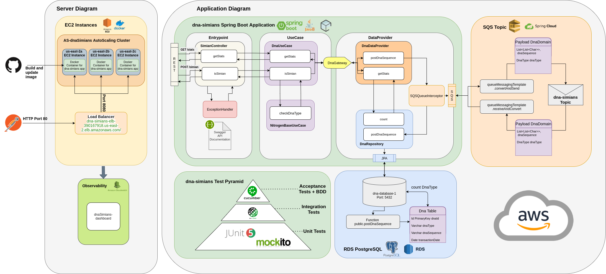

## Tópicos
* [Descrição](#descrição)
* [Desenho da Solução](#desenho-da-solução)
* [Tecnologias Utilizadas](#tecnologias-utilizadas)
* [Como rodar a aplicação](#como-rodar-a-aplicação)
* [Observability](#observability)
* [Desenvolvedores](#desenvolvedores)
* [Links Úteis](#links-úteis)

## Descrição

Este projeto tem o objetivo de implantar uma aplicação **Dna Simians** utilizando como tecnologia principal Spring Boot e Clean Architecture para disponibilizar um recurso para validação de um determinado Dna recebido. 
O Dna recebido será validado de acordo com os caracteres que representam as bases nitrogenadas de um Dna, além de definir o tipo de Dna ao qual se enquadra,**humano** ou **símio.** 

* A aplicação poderá ser utilizada com chamadas via **API**, via domínio implantado pela **AWS Elastic Compute Cloud** (**URL:** http://dna-simians-elb-390167918.us-east-2.elb.amazonaws.com/). Confira o passo a passo para se conectar com a API no tópico [Como rodar a aplicação: API](#api).

### Recursos

A API irá expôr 2 endpoints a fim de realizar a **verificação**, **postagem** no banco de dados de um determinado tipo de DNA e **recuperar** o número de casos registrados para cada tipo de DNA.

- **POST /simian** - recebe como RequestBody um array de String com as informações de registro de um determinado DNA (limitado aos caracteres referenciados para as bases nitrogenadas: **A, C, T e G.**
Realiza a análise do Dna recebido para definir se é um Dna **Humano** ou **Símio** conforme modelo abaixo. Se possuir uma sequência **horizontal**, **vertical** ou **diagonal** de **4** ou mais bases nitrogenadas **iguais**, trata-se do Dna de um Símio: 

Caso o DNA seja identificado como um símio, é retornado um **HTTP-200-OK** , caso
contrário um **HTTP-403-FORBIDDEN** .
Após a verificação, o registro é incluído no banco de dados da aplicação.

- **GET /stats** - realiza uma busca no banco de dados registrado na aplicação retornando o **número** de Dna's registrados para **humanos**, **símios**, e a **relação** entre os dois conforme Response abaixo:
> **{"count_mutant_dna": 40, "count_human_dna": 100: "ratio": 0.4}**

Além dos recursos informados, a rota também contém um endpoint do **Swagger** que expõe a documentação da API:
> http://dna-simians-elb-390167918.us-east-2.elb.amazonaws.com/swagger-ui/index.html

## Desenho da Solução

 

## Tecnologias utilizadas

#### Desenvolvimento:    

#### Build/Packaging : 

#### Tests:    

#### Inspection: 

#### API Documentation: 

#### Deploy:  

#### Observability:  

## Como rodar a aplicação

### API

**Via AWS EC2:**
* Para rodar a API, foi disponibilizado um host via deploy na AWS EC2 - região us-east-2 para acessar facilmente os endpoints via Postman:
	* > http://dna-simians-elb-390167918.us-east-2.elb.amazonaws.com/

**Collection:**
* Foi disponibilizada uma collection via Postman com exemplos de chamadas para casos de sucesso, tanto para Dna's humanos ou símios, e casos de erro:
	* > https://www.getpostman.com/collections/972a90c052f90f84239f

**Endpoints criados:**
* `/actuator` - Retorna os endpoints com informações de saúde da aplicação
* `/swagger-ui/index.html` - Retorna a documentação da API
* POST `/simian` - Realiza a validação do tipo do Dna e o registro das informações inseridas no body seguindo o modelo JSON e respeitando o tamanho da String para o número de recursos, formando uma tabela NxN:
	* {"dna": "ACTG", "CTGA", "AAAA", "TTTT"}
* GET `/stats` - Realiza a busca dos números de Dna registrados para humanos, símios e a relação entre os dois.
		

## Database

As informações inseridas via API ao realizar um **POST** no endpoint **"/simian"** e buscadas pelo **GET** no endpoint **"/stats"** estão armazenadas em uma instância **RDS** da AWS para um banco de dados **PostgreSQL**: dna-database-1.

Abaixo segue o modelo de dados deste banco de dados:

### Database dna-database-1 -> Schema public -> Table dna
|dnaId|dnaSequence|dnaType|transactionDate|
| -------- | -------- | -------- |-------- |
|**(VARCHAR 36) - PrimaryKey** "36 digit dna UUID" |**(VARCHAR 255)** "[A, T, C, G]"|**(VARCHAR 20)** HUMAN or SIMIAN|**(DATE)** yyyy-MM-dd|

## Observability

## Desenvolvedores

[    Guilherme Mendes ](https://github.com/guimsmendes) |
| :---: |  

## Links úteis
* [Deploy de um container Docker em uma instância EC2](https://www.javacodegeeks.com/2019/10/deploy-spring-boot-application-aws-ec2-instance.html)
* [Spring Cloud - Messaging](https://docs.awspring.io/spring-cloud-aws/docs/current/reference/html/index.html#messaging)
* [SQS - Sending and Receiving messages with AWS](https://www.baeldung.com/spring-cloud-aws-messaging)

